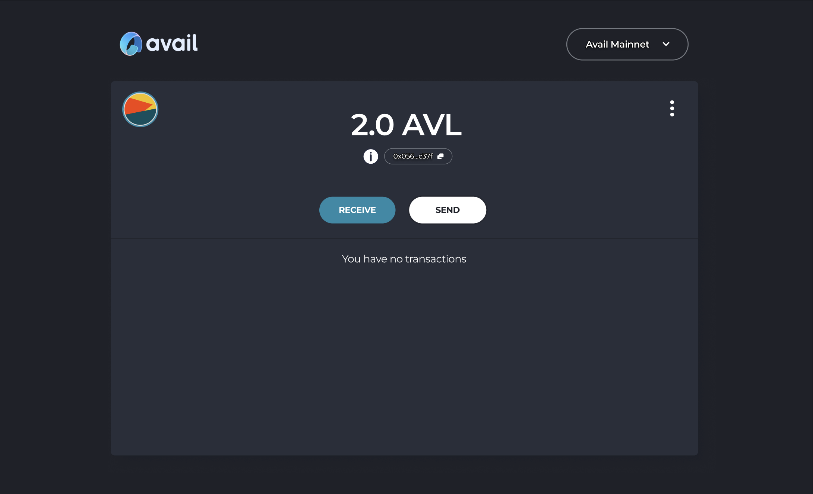

# Avail wallet snap.

This project uses the [MetaMask Snaps](https://metamask.io/snaps/) framework to extend MetaMask
capabilities to include support for Avail.
[Substrate](https://docs.substrate.io/)- and FRAME-based blockchains in the
[Polkadot](https://www.polkadot.network/) ecosystem.

## Documentation

This snap is a built on top of polkadot snap by chainsafe, its architecture, integration steps and detailed API documentation for dApp
developers is covered in the
[project wiki](https://github.com/ChainSafe/metamask-snap-polkadot/wiki), which also includes a
usage guide for the example dApp

## Local Development

Developers who wish to use the snap locally must use [MetaMask Flask](https://metamask.io/flask/);
run the following commands from the project root to launch the
[Polkadot Wallet Snap Example dApp](https://github.com/ChainSafe/metamask-snap-polkadot/tree/master/packages/example).
Please make sure to be using yarn for everything.

- `yarn install`
- `cd packages/snap`
- `rm -rf build && rm -rf dist && cd ../.. && yarn build:snap && yarn build:adapter && cd packages/snap && yarn mm-snap manifest --fix`
- `yarn start`  

In another terminal

- `cd packages/example`
- `yarn start`

## Avail Snap Design

[FIGMA Designs](https://www.figma.com/file/03bs8ccbT7nR1a8KTGTZJ6/Metamask-Avail-Snap-team-library?type=design&node-id=0%3A1&mode=design&t=5gQcjL32P2mcXtuv-1)

## Contribution Guidelines

### Rules

Avail welcomes contributors from every background and skill level. Our mission is to build a community that's not only welcoming and friendly but also aligned with the best development practices. Interested in contributing to this project? Whether you've spotted an issue, have improvement ideas, or want to add new features, we'd love to have your input. Simply open a GitHub issue or submit a pull request to get started.

1. Before asking any questions regarding how the project works, please read through all the documentation and install the project on your own local machine to try it and understand how it works. Please ask your questions in open channels (Github and [Telegram](https://t.me/avail_uncharted/5)).

2. To work on an issue, first, get approval from a maintainer or team member. You can request to be assigned by commenting on the issue in GitHub. This respects the efforts of others who may already be working on the same issue. Unapproved PRs may be declined.

3. When assigned to an issue, it's expected that you're ready to actively work on it. After assignment, please provide a draft PR or update within one week. If you encounter delays, communicate with us to maintain your assignment.

4. Got an idea or found a bug? Open an issue with the tags [New Feature] or [Bug]. Provide detailed information like reproduction steps (for bugs) or a basic feature proposal. The team will review and potentially assign you to it.

5. Start a draft PR early in your development process, even with incomplete changes. This allows us to track progress, provide timely reviews, and assist you. Expect feedback on your drafts periodically.

## License

Copyright [2020] [ChainSafe Systems]

Licensed under the Apache License, Version 2.0 (the "License");
you may not use this file except in compliance with the License.
You may obtain a copy of the License at

http://www.apache.org/licenses/LICENSE-2.0

Unless required by applicable law or agreed to in writing, software
distributed under the License is distributed on an "AS IS" BASIS,
WITHOUT WARRANTIES OR CONDITIONS OF ANY KIND, either express or implied.
See the License for the specific language governing permissions and
limitations under the License.
